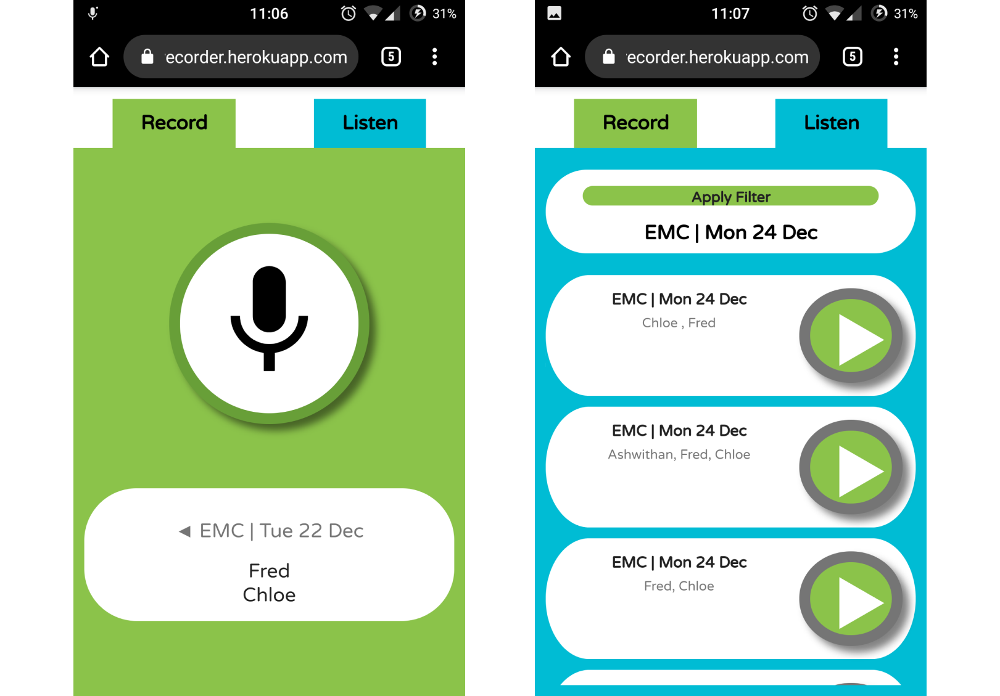

# ClassRecorder

## Purpose

This is a prototype of an app to capture verbal feedback & thinking in the classroom. Traditional dictaphones make it difficult to search through recorded data, this aims to store clips in a way that is more readilly searchable.

## Design Notes
- Uses gulp build scripts
- Uses IndexedDB for offline data storage
- Offline functionality provided with Service Worker
- Uses sass for styling
- Uses MediaStream API

## Installation

### Dependancies
- [Node & npm](https://nodejs.org/en/)

### Running the app
- Clone the repository
- Navigate to the project directory in command line
- run command `npm install`
- run command `gulp`

The server is not running on [https://localserver:3000](https://localserver:3000)

## Implementation Notes

Currently the various parts of the app are not separated into modules - with separate files loaded in script tags in the html.

`app.js` defines two objects using immediately-invoked function expression so that it exposes only the relevant properties and functions.
- **updateManager** - holds the reference to the service worker and co-ordinates UI elements to allow the user to update
- **recorderApp** - holds all code to do with the operation of the core functionality of the app

One Javascript class is used in the update manager
- **ServiceWorkerHelper** - Registers a new service worker, monitors for state changes (installed/ready events) and triggers callback to inform user of the new service worker installation.

Three Javascript classes are used in the recorder app
- **StudentSelectModel** - forselecting students (to tag audio clips with for searching)
- **FilterModel** - for defining a filter to search through recorded clips
- **DBHelper** - for interfacing with indexedDB database (retrieving/storing data)

`app.js` contains
- functions that render the HTML for the page from the relevant StudentSelect/Filter Models
- event listener declarations on various interactive pieces of the page
